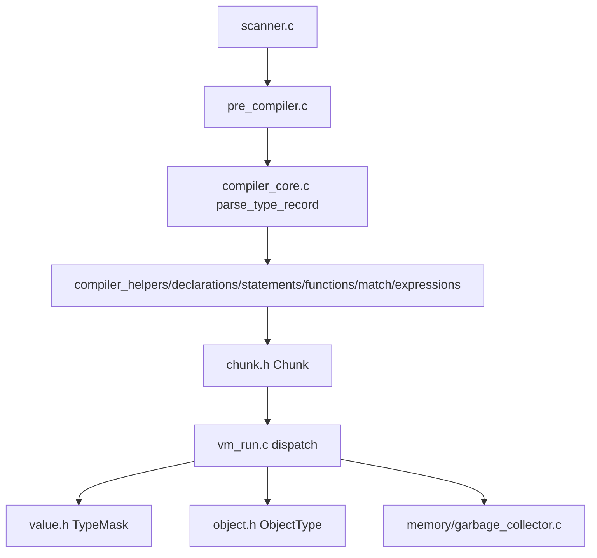

# Architecture — See `src/README.md` (starting point)

- `compiler`: scanner, compiler_* `docs/contributor/compiler.md`
- `_headers`: internal headers `crux.h` public `include/crux.h`
- `memory`: GC `gc` `docs/contributor/gc.md`
- `native`: C natives `docs/contributor/native.md`
- `type_system`: `types_compatible` `docs/contributor/type-system.md`
- `vm`: dispatch `docs/contributor/vm.md`

Pipeline

Constants `common.h:12` `FRAMES_MAX=128` `STACK_MAX≈2MB` `MATCH_NEST_DEPTH=16` `GC` `MIN_GC_HEAP_SIZE 1MB` `SLAB_CAPACITY 4096`.
