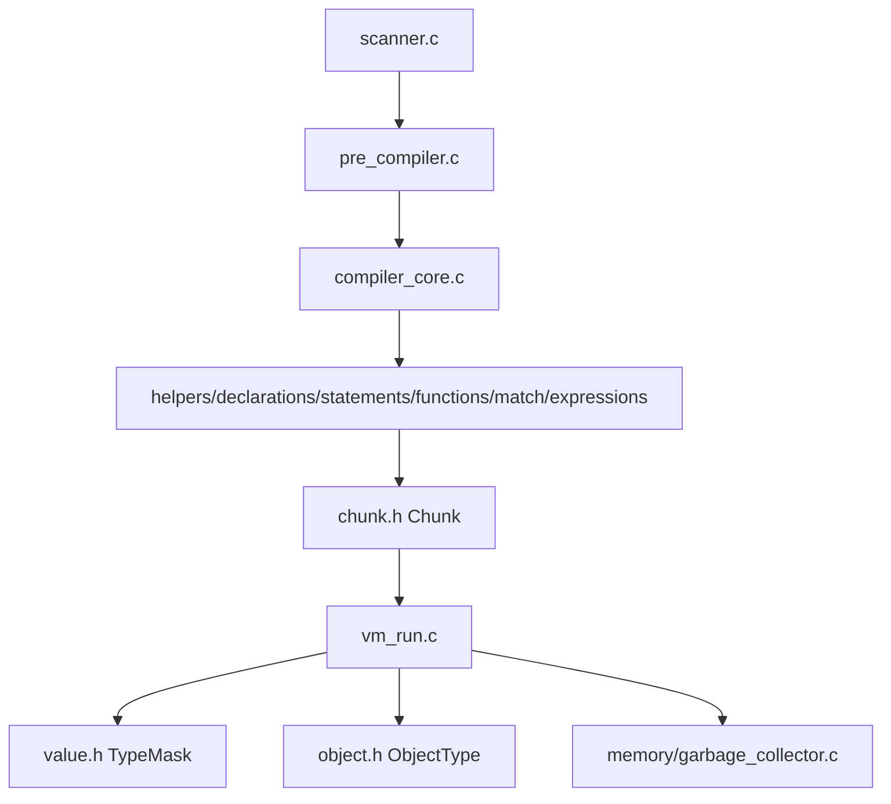

# Crux Source — Contributor Starting Point

> Keep this file as the contributor entry. Full docs live in [`docs/`](../docs/README.md) (GitHub-rendered, no website).

This directory contains the Crux implementation. All sources are required to build.

- `compiler/` — scanner `src/_headers/scanner.h:10`, `pre_compiler.c`, `compiler_core.c:23` `parse_type_record`, `compiler_helpers/declarations/statements/functions/match/expressions` → `Chunk` `src/_headers/chunk.h:6`. See [Compiler](../docs/contributor/compiler.md).
- `src/_headers/` — internal headers (`common.h:12` constants `FRAMES_MAX`, `STACK_MAX`, `MATCH_NEST_DEPTH`). Public API is `include/crux.h:1` — see [Native API](../docs/reference/native-api.md).
- `memory/` — `garbage_collector.c`, `slab_allocator.c:12` (`slab_24/32/48/64`, `SLAB_CAPACITY=4096`), `alloc.c` `Crux_reallocate` longjmp. See [GC](../docs/contributor/gc.md).
- `native/` — C natives `src/native/*.c` registered `native_registration.c:252`. See [Native](../docs/contributor/native.md) + per-module [Stdlib](../docs/stdlib/README.md).
- `type_system/` — `type_system.c:322` `types_compatible`/`types_equal`, `type_table.c`, `TypeMask` `value.h:47`. See [Type System](../docs/contributor/type-system.md).
- `vm/` — `vm_run.c` dispatch `CallFrame` `vm.h:125`, `vm_helpers.c`, `OpCode` `chunk.h:6`. See [VM](../docs/contributor/vm.md).
- `object/` — `object.c` `vector_helpers.c` `matrix_helpers.c`, `ObjectType` `object.h:104` (+ `CRUX_TAGGED_OBJECT` `object.h:144`). See [Object Types](../docs/reference/object-types.md).
- `cli/` — `src/cli/main.c:11` `crux` REPL/`run`/`init`/`install` `cli_commands.c`. See [CLI](../docs/tools/cli.md).
- `type_system/` and `object/` also define `CRUX_QNAN` tagging `include/crux.h:54`.

## Architecture Diagram (mermaid — GitHub renders, ASCII fallback)

ASCII: `scanner → pre_compiler → compiler_core/helpers → Chunk → vm_run → value/object → GC`

## Where Next

- **Build** → [Tools: Build](../docs/tools/build.md) `CMakeLists.txt:10` flags
- **Tests** → [Testing](../docs/contributor/testing.md) `tests/test_runner.py:5` + `std/_std_test`
- **Embed** → [Embedding Lifecycle](../docs/embedding/lifecycle.md) `include/crux.h`
- **Language** → [Syntax](../docs/language/syntax.md) `scanner.h:10`

All of these sources are required to compile Crux. Nothing is optional.

See [docs/README.md](../docs/README.md) for full index.
